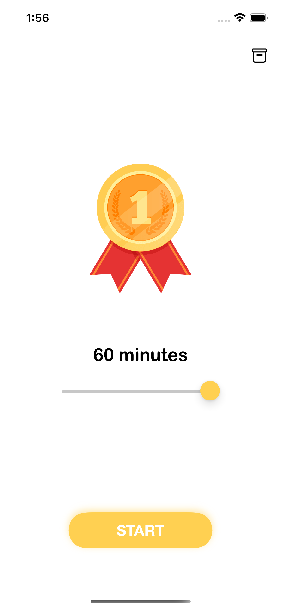
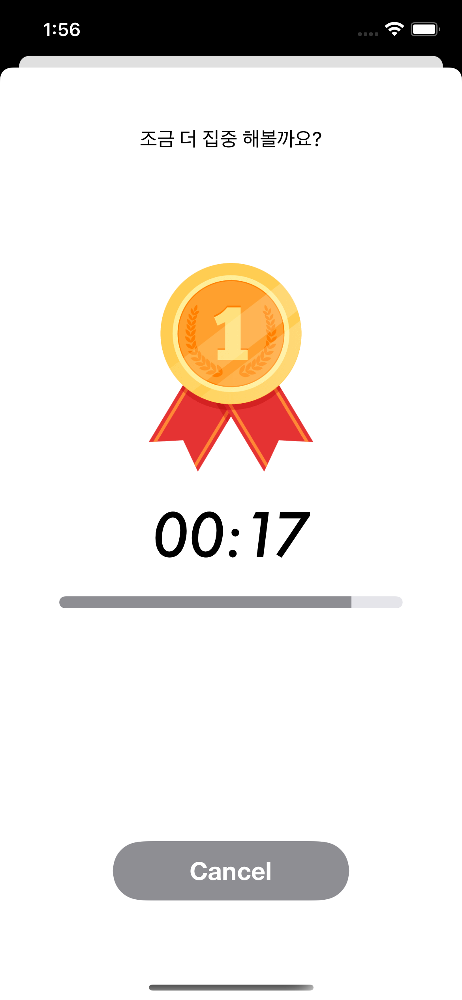
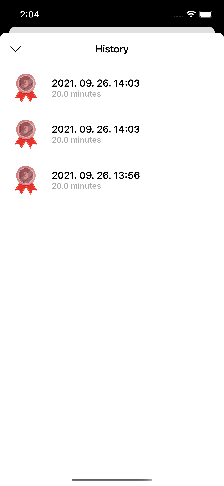

## 🧑‍🎓 Focus
유료앱 상위권에 머물고 있고, 전 세계적으로도 유명한 집중앱 Forest 의 핵심 기능을 클론 앱으로 만들어 본다.
Focus 는 iOS 의 App Life Cycle 을 이용하여 다른 앱으로 이동할 경우의 이벤트를 받아서 집중하기 라는 기능을 만들었다.

## 내용
- App Life Cycle
- UIViewController Life Cycle
- NotificationCenter 에 대해 알아보고 Delegate 패턴과의 차이점 알아보기
- UserDefaults 개념 및 사용해보기

## 최종화면
  

## 더 고민해봐야 할 사항
- 집중모드를 실행한 후에 앱을 강제종료할 경우 여전히 알림이 뜨는데 이 부분을 어떻게 제어하면 될까?

